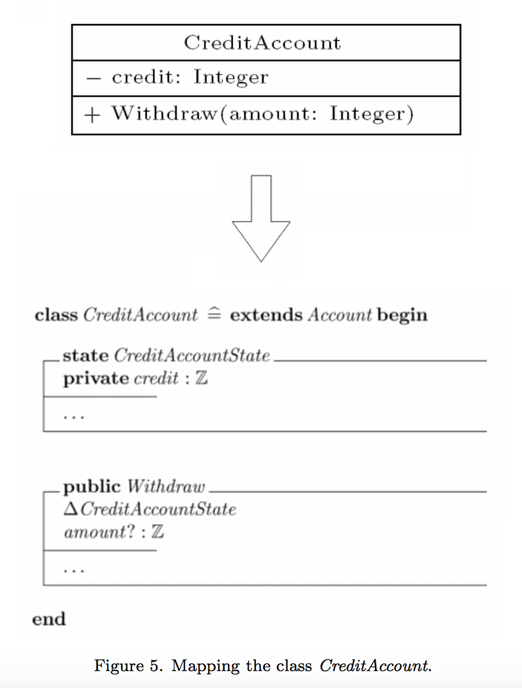

# Métodos formales V/S UML - Portafolio Semana 15

En el siguiente portafolio se realizará un análisis sobre la importancia de los métodos formales como una forma de especificar requerimientos de forma exhaustiva. Para esto se utilizarán dos artefactos, los que corresponden a los siguientes papers disponibles de forma *online*: ["Integrating UML and Formal Methods"](https://ac.els-cdn.com/S1571066107004379/1-s2.0-S1571066107004379-main.pdf?_tid=d0d8c37e-c989-11e7-8ef9-00000aab0f6b&acdnat=1510698121_e868b7c819250ca5ca09f925c58fe0e3) y ["UML Automatic Verification Tool with Formal Methods"](https://ac.els-cdn.com/S1571066105001751/1-s2.0-S1571066105001751-main.pdf?_tid=7a940dd6-c98c-11e7-ae12-00000aacb360&acdnat=1510699264_c3abf18abb5e011ece7a9c4cc9f7dccc) (se citarán y se darán como sustento de la argumentación siguiente), los métodos formales están directamente relacionados con el curso pues son una forma de dar especificaciones y se abordaron en la clase del 3 de noviembre.

## ¿Qué son los métodos formales y cómo se comparan contra el UML?

Un método formal es una técnica basada en
matemáticas, usada para describir sistemas de
hardware o software, Wing, Jeannette M. (1990).
Los métodos formales permiten representar la
especificación del software, verificación y diseño de
componentes mediante notaciones matemáticas. 
Por otro lado, el UML (*Unified Modeling Language*) es un lenguaje de modelado visual, creado para especificar la modelación, la implementación, el diseño y la arquitectura de sistemas de software complejos, tanto en estructura como en comportamiento.

Los métodos formales y los diagramas UML vienen a cumplir la tarea de especificar requerimientos de un software a construir o construido (también en hardware en algunos casos), es decir, cumplen la tarea de describir el diseño de un software. Para realizar esto utilizan una abstracción del código en sí, por un lado usando UML se realiza esta abstracción mostrando componentes y recursos de software de forma visual mediante diagramas, en cambio, los métodos formales hacen una especificación exhaustiva utilizando lenguaje natural y matemático.

Como menciona Beato (2005), es bastamente aceptado que la detección de errores en las fases tempranas del desarrollo reduce substancialmente el costo y el tiempo de desarrollo, ya que los errores detectados no se transmiten y amplifican en las etapas siguientes. Con lo que resulta claro que es deseable utilizar alguna de estas especificaciones de forma temprana al desarrollar un software.

Ahora bien entre las dos especificaciones hay claras diferencias, algunas de ellas se listarán a continuación:

1. UML es un lenguaje visual de menor complejidad, lo que lo hace tener una ventaja indiscutible frente a los métodos formales, ya que es más claro y fácil de entender, esto permite que el lenguaje pueda ser leído por personas que no sean expertas en temas relacionados al software.
2. UML al no ser tan potente (semánticamente hablando) como los métodos formales, se presta para dejar ambiguedades en las especificaciones, lo que puede ser una fuente peligrosa de error para algunos sistemas.
3. Los métodos formales no poseen una unificación universal de estilo como si lo tiene el UML, existen diversos métodos formales que no comparten por completo su sintaxis.
4. UML es comúnmente utilizado en la industria y en la academia, mientras que los métodos formales se utilizan mayormente en la academia. Este hecho se debe a que debido a la complejidad de éstos últimos es una decisión difícil y costosa ocuparlos.

## Análisis de las alternativas expuestas para modelar

Si vemos el nivel de expresividad y detalle que podemos obtener utilizando métodos formales, a mi parecer resulta fácil inclinarse por utilizar esta alternativa, pero se nos presenta un primer punto importante para cambiar de opinión, el que en efecto es la mayor consideración que se hace en la industria para no utilizarlos: El *overhead* de tiempo que suma utilizar esta metodología tan complicada.

Los métodos formales poseen un fuerte sustento matemático y sus especificaciones son muy extensan, por lo que un equipo de desarrollo que quiera ocuparlos debe contar con un fuerte *background* de habilidades matemáticas y de ciencias de la computación, es por esto que resulta muy costoso crearlos en términos monetarios y de tiempo (dado que las personas que los realizan deben ser expertos en el tema).

Si bien en UML existen formas de crear especificaciones más robustas, por ejemplo utilizando OCL (*Object Constraint Language*), a mi parecer los diagramas UML no logran representar todas las características de un software, lo que hace que ver características de "calidad de código" no sean fáciles de observar en la documentación creada, esto en mi opinión se debe principalmente a dos motivos:

* **Flexibilidad del lenguaje:** UML es un lenguaje estándar universalmente aceptado en el mundo del desarrollo, existe un consenso en los elementos que se pueden ocupar pero no en el mínimo nivel de expresividad que se debe ocupar. Muchas veces vemos diagramas muy completos, en dónde se colocan todos los tipos de los atributos, pero otras veces no se colocan nisiquiera todos los atributos, esto representa un problema pues ambos diagramas son totalmente válidos.
* **Falta de expresividad:** Como se menciona anteriormente UML no llega a tener el nivel de expresividad que se puede lograr con métodos formales, por lo que se deben utilizar extensiones para alcanzar un nivel de especificación que no deje ambiguedad alguna.

Es por esto, que viendo diagramas UML no es trivial decidir que principios fundamentales se están violando o qué principios SOLID se están siguiendo y cuales no. La "facilidad" de encontrar problemas de diseño está derechamente relacionada con el nivel de especificación que se use en los diagramas, en efecto si estos no son lo suficientemente completos se pueden obtener "falsos positivos" y encontrar problemas donde no los hay o por el contrario no encontrar problemas existentes como por ejemplo podría ser ver el principio SOLID de *Single Responsability* el que no sería difícil de encontrar en un diagrama de clases completo.

## Solución propuesta

En los papers se da por aceptado que los métodos formales entregan un nivel de especificación mayor a los diagramas UML, pero el tiempo que se necesita invertir para lograr esta especificación es muy grande y muchas veces choca con los tiempos disponibles en la industria, más aún si se utilizan metodologías ágiles en dónde los tiempos entre ciclos son menores.

Sin embargo, la utilización de métodos formales entrega mayor seguridad de que no se presentarán ambiguedades de documentación, es por esto que los autores proponen herramientas automatizadas para transformar diagramas UML en métodos formales y completar la información que la herramienta no pueda rellenar. De esta forma se tendrán especificaciones completas y el *overhead* de utilizar métodos formales no será tan grande gracias a la herramienta, la que hace un mapeo entre diagramas UML y los métodos.

Se busca realizar un cambio como el siguiente:

## Conclusión

Me parece que los métodos formales son una forma de especificación muy completa pero no se utilizan pues son muy difíciles de crear, las herramientas automatizadas propuestas bajan el tiempo de creación de estas especificaciones y entregan la posibilidad de completarlas.

Hoy en día los métodos formales solo se utilizan en sistemas en donde una falla pueda comprometer vidas o en procesos sumamente importantes, ayudandose con estas herramientas se podrían utilizar para más tipos de software y en mi opinión se avanzaría en la calidad de documentación que se crea. Esto permitiría que los análisis de principios de "buen código" como los fundamentales o los SOLID, fuesen más fáciles de realizar y se podrían tener equipos encargados a revisar la documentación para encontrar errores abstrayendose del código lo que sería deseable al poder realizar una crítica insesgada (asumiendo que los *reviewers* no son los creadores del código).

